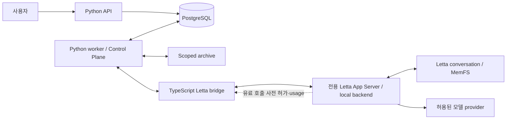
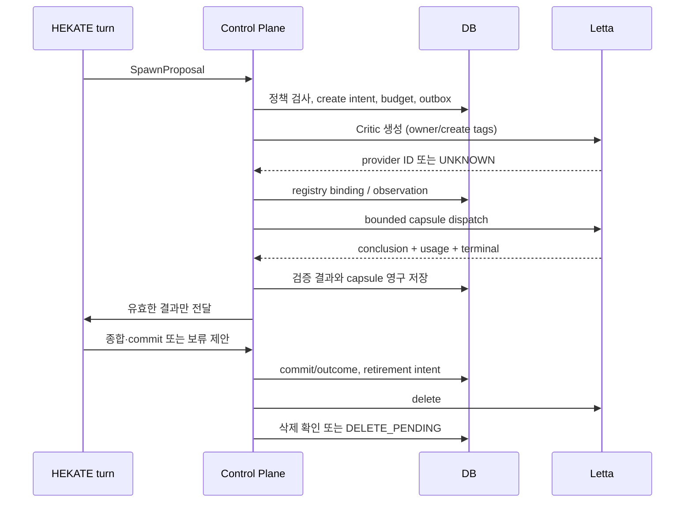

# HEKATE v0.1 — 디렉토리·파일·함수 상세 설계

설계일: 2026-09-29 · 상태: 구현 청사진, 실행 검증 전

이 문서는 첨부된 37절 명세를 구현 단위로 분해한다. 아래 디렉토리는 **만들 저장소의 설계**이며, 동작하지 않는 stub 파일을 실제 구현처럼 생성한 것이 아니다. 공개 함수·메서드의 입력, 출력, 책임을 정의하고 내부 private helper는 구현 과정에서 추가한다.

## 1. 배포와 의존성



마지막 점선은 **추가 통합 계약**이다. 현행 Letta에 완성된 HEKATE용 hook이 있다고 가정하지 않는다. [조사 문서](01-Letta-조사와-언어-판단.md)의 제한과 [Phase 0 gate](03-통합검증과-구현순서.md)를 먼저 해결해야 한다.

Python은 3.12 이상 중 선택한 minor와 patch를 고정한다. 제안 스택은 FastAPI, Pydantic v2, SQLAlchemy 2 async, psycopg, Alembic, pytest, Hypothesis, Ruff, strict type checker다. 실제 lockfile 버전은 통합 검증 시 결정한다. PostgreSQL은 Application Store로 사용하고 Letta의 내부 저장소에 직접 SQL을 실행하지 않는다.

외부 schema에는 Pydantic strict validation을 적용하고, 동시 작업마다 별도의 SQLAlchemy AsyncSession/UnitOfWork를 사용한다. 하나의 mutable DB session을 병렬 task끼리 공유하지 않는다. [Pydantic strict mode](https://docs.pydantic.dev/latest/concepts/strict_mode/), [SQLAlchemy asyncio](https://docs.sqlalchemy.org/en/20/orm/extensions/asyncio.html), [FastAPI async 실행](https://fastapi.tiangolo.com/async/)

초기 실행은 API 1개, DB-backed worker 1개, bridge 1개, 전용 App Server 1개다. worker 안에서는 서로 다른 agent의 제한된 I/O를 병렬 처리할 수 있다. Redis, Celery, Kafka, Temporal, vector DB는 HEKATE 의존성에 추가하지 않는다. Letta 구현의 내부 의존성과는 구분한다.

의존 방향은 `api / worker → application → domain + ports`이며 `infrastructure`가 ports를 구현한다. domain은 FastAPI, SQLAlchemy, Letta SDK를 import하지 않는다. 구성과 연결은 `bootstrap.py` 한 곳에서 담당한다.

## 2. 저장소 구조

```text
hekate/
├── README.md
├── pyproject.toml
├── uv.lock
├── .env.example
├── .gitignore
├── config/
│   ├── policy.yaml
│   ├── models.yaml
│   ├── pricing.yaml
│   └── evaluation.yaml
├── prompts/
│   ├── hekate_identity.md
│   ├── hekate_planning.md
│   ├── hekate_synthesis.md
│   ├── critic_review.md
│   └── schema_repair.md
├── contracts/
│   ├── generated/                    # Pydantic에서 생성, 수동 수정 금지
│   │   ├── task-capsule.v1.schema.json
│   │   ├── conclusion-capsule.v1.schema.json
│   │   ├── hekate-proposal.v1.schema.json
│   │   ├── position-commit.v1.schema.json
│   │   └── bridge.v1.schema.json
│   └── examples/                     # 각 schema의 정상/거절 예제 JSON
├── src/hekate/
│   ├── __init__.py
│   ├── __main__.py
│   ├── bootstrap.py
│   ├── settings.py
│   ├── api/
│   │   ├── app.py
│   │   ├── auth.py
│   │   └── routes.py
│   ├── domain/
│   │   ├── types.py
│   │   ├── models.py
│   │   ├── capsules.py
│   │   ├── proposals.py
│   │   ├── transitions.py
│   │   ├── policy.py
│   │   ├── budget_math.py
│   │   └── errors.py
│   ├── ports/
│   │   ├── runtime.py
│   │   ├── store.py
│   │   └── resources.py
│   ├── application/
│   │   ├── tasks.py
│   │   ├── turns.py
│   │   ├── scheduler.py
│   │   ├── lifecycle.py
│   │   ├── results.py
│   │   ├── budgets.py
│   │   ├── positions.py
│   │   ├── evidence.py
│   │   ├── tools.py
│   │   ├── recovery.py
│   │   └── projections.py
│   ├── infrastructure/
│   │   ├── postgres/
│   │   │   ├── database.py
│   │   │   ├── tables.py
│   │   │   ├── task_repository.py
│   │   │   ├── agent_repository.py
│   │   │   ├── budget_repository.py
│   │   │   ├── knowledge_repository.py
│   │   │   └── delivery_repository.py
│   │   ├── letta/
│   │   │   ├── adapter.py
│   │   │   └── bridge_protocol.py
│   │   ├── archive.py
│   │   └── observability.py
│   ├── worker/
│   │   └── service.py
│   └── evaluation/
│       ├── runner.py
│       └── scoring.py
├── bridge/letta/
│   ├── package.json
│   ├── package-lock.json
│   ├── tsconfig.json
│   ├── src/
│   │   ├── main.ts
│   │   ├── protocol.ts
│   │   ├── agents.ts
│   │   ├── sessions.ts
│   │   ├── tools.ts
│   │   ├── events.ts
│   │   ├── limits.ts
│   │   └── memory.ts
│   └── tests/
│       ├── protocol.test.ts
│       ├── sessions.test.ts
│       ├── tools.test.ts
│       └── limits.test.ts
├── integration/letta/
│   ├── versions.lock.json
│   ├── capability-matrix.json
│   ├── runtime-guard-contract.md
│   └── patches/
│       └── README.md                # 필요한 경우에만 고정 SHA용 patch 추가
├── migrations/
│   ├── env.py
│   └── versions/
│       ├── 0001_operations.py
│       ├── 0002_budget.py
│       └── 0003_knowledge.py
├── scripts/
│   ├── export_contracts.py
│   ├── integration_probe.py
│   └── run_evaluation.py
├── tests/
│   ├── conftest.py
│   ├── fakes/
│   │   ├── runtime.py
│   │   └── clock.py
│   ├── unit/
│   │   ├── test_transitions.py
│   │   ├── test_policy.py
│   │   ├── test_budget_math.py
│   │   └── test_capsules.py
│   ├── integration/
│   │   ├── test_position_commit.py
│   │   ├── test_budget_concurrency.py
│   │   ├── test_turn_serialization.py
│   │   └── test_store_atomicity.py
│   ├── fault/
│   │   ├── test_lifecycle_recovery.py
│   │   ├── test_result_delivery.py
│   │   ├── test_cancel_and_revision.py
│   │   ├── test_budget_failure.py
│   │   └── test_security_and_storage.py
│   └── contract/
│       ├── test_letta_capabilities.py
│       ├── test_billable_guard.py
│       └── test_schema_compatibility.py
├── evals/
│   ├── cases.jsonl
│   ├── rubric.yaml
│   └── thresholds.yaml
├── deploy/
│   ├── compose.yaml
│   ├── control-plane.Dockerfile
│   ├── bridge.Dockerfile
│   ├── letta-settings.json
│   └── network-policy.md
└── docs/
    ├── architecture.md
    ├── operations.md
    └── decisions.md
```

각 package의 `__init__.py`는 필요한 곳에 추가한다. `patches/`는 통합 검증 결과 필요한 경우에만 사용하며, 현재 patch를 작성하거나 적용했다는 뜻은 아니다.

## 3. 타입·schema 계약

아래 식별자는 서로 바꿔 쓸 수 없는 타입으로 취급한다. Python에서는 NewType 또는 값 객체와 strict type checking을 사용하고, 외부 입력은 runtime validation을 추가한다.

```python
TaskId, AttemptId, RegistryId, OperationId, EvidenceId, TopicId, ReservationId
ProviderAgentId, ConversationId, ProviderCallId, ResultId, PrincipalId
Revision = int       # 1 이상
PositionVersion = int  # 0은 아직 생성되지 않은 topic
Money = Decimal      # float 금지, DB NUMERIC, USD 고정
Instant = datetime   # timezone-aware UTC
```

ID는 Control Plane이 발급한다. 모델이 제시한 ID는 기존 binding과 대조할 뿐 권한의 근거가 되지 않는다. 표의 함수는 Python 표기로 적는다. `async`는 I/O가 있는 함수이고, 일반 함수는 별도 설명이 없으면 pure function이다.

### 3.1 주요 레코드

| 타입 | 필수 필드와 역할 |
|---|---|
| `ActorContext` | principal_id, scope, authenticated_agent_registry_id, task_id, attempt_id, input_revision, policy_version, authz_epoch, fence. 외부 JSON에서 직접 생성하지 않음 |
| `Task` | id, scope, question, input_revision, constraints_hash, status, topic_id, base_position_version, deadline, counters, outcome, stop_reason |
| `Attempt` | id, task_id, kind, parent_attempt_id, review_round, input_revision, agent_registry_id, status, operation_id, reservation_id, provider_binding, deadline |
| `AgentRecord` | registry_id, kind=`hekate/critic`, creation_operation_id, provider_id?, intended_state, observation, observed_at, active_attempt_id?, policy_version |
| `Operation` | id, kind, request_hash, owner_scope, state, observation, provider_ids, retry_of?, last_error, next_check_at |
| `ExecutionEnvelope` | task/attempt/operation IDs, revision, principal binding, model allowlist, price version, deadline, token bounds, billable-call slots, tool bounds, fence, reservation_id |
| `ProviderObservation` | state=`PRESENT/ABSENT/RUNNING/STOPPED/UNKNOWN`, 관찰 근거, observed_at. UNKNOWN은 실패했다는 뜻이 아님 |
| `RuntimeEvent` | schema_version, binding, stable_event_key, event_kind, provider identifiers, normalized payload. hidden reasoning 제거 후 전달 |
| `UsageRecord` | provider_call_id, input/output/cache/reasoning fields?, quantity semantics, pricing_version, completeness, observed_at, monetary estimate/actual |
| `BudgetReservation` | id, operation_id, purpose, account links, reserved_amount, settled_amount?, status, model/pricing revision |
| `PositionVersionRecord` | topic_id, version, base_version, immutable body, operation_id, actor/task/revision provenance |
| `EvidenceRecord` | 원 명세의 모든 항목 + availability, access_epoch, content_version, expiry_at, root_source_ids |
| `StoredConclusion` | normalized capsule, validation status, accepted eligibility, payload hash, provider provenance, rejection reason |
| `RecoveryCase` | operation_id, observed facts, unknown reason, automated actions tried, operator decision record |

`Attempt.kind`는 `planning / critic_review / synthesis / schema_repair / transient_retry / final_response`다. runtime 내부 model step과 compaction은 `provider_calls`에 기록한다. task budget은 이를 모두 포함하지만 attempt 비용과 call 비용을 중복 합산하지 않는다.

### 3.2 Capsule과 proposal

wire schema는 `schema_version: "1"`, 알 수 없는 필드 금지, 크기·배열 길이 제한을 적용한다. 최대 길이는 `policy.yaml`과 schema 생성 설정에서 일치시킨다. 문자열을 eval, 동적 import, 임의 함수 이름으로 실행하지 않는다.

| schema | 내용 |
|---|---|
| `TaskCapsule` | 첨부 §10 유지. task/attempt/revision, objective, role, mode, typed premises, evidence refs, target position, constraints, expected output, 설명용 limits/profile |
| `ConclusionCapsule` | 첨부 §11 유지. assessment, confidence, evidence_used, objections, assumptions, unresolved, next step, position recommendation |
| `HekateProposal` | `action`으로 구별하는 union. `answer / spawn / continue / retrieve_evidence / request_information / wait / stop / commit / abstain` |
| `SpawnProposal` | role=critic, purpose, target_uncertainty, expected_decision_impact, task_id. budget이나 grant를 포함하지 않음 |
| `ContinuationProposal` | unresolved_issue, next_action, expected_information_gain, decision_impact. 단순 자유문만으로 승인하지 않음 |
| `PositionCommitRequest` | operation_id, task_id, topic_id, base_version, input_revision, proposed_position, reason_for_change |
| `PositionBody` | statement, scope/applicability, confidence, evidence_refs, assumptions, dissent_refs, uncertainty, provenance |
| `ToolRequest` | tool_call_id, name, arguments. actor와 scope는 trusted runtime binding에서 별도 주입 |

Conclusion의 objection은 저장할 때 내부 `dissent_id`를 발급한다. `O1` 같은 capsule 내부 ID를 모든 task에서 공유하지 않는다. Position의 `dissent_refs`는 영구 저장된 dissent 레코드를 가리킨다.

schema repair는 타입과 필수 필드를 수정하는 용도다. 존재하지 않는 참조, scope 위반, actor 위조를 repair로 통과시키지 않는다. 의미적 평가는 HEKATE turn에서 수행한다.

## 4. Python 파일과 공개 함수

### 4.1 시작·설정·HTTP

| 파일 | 함수·메서드 | 계약 |
|---|---|---|
| `__main__.py` | `main(argv: Sequence[str]) -> int` | `serve`, `worker`, `reconcile`, `doctor` 진입점. 분석·LLM 작업을 import 시 실행하지 않음 |
| `settings.py` | `load_settings(env: Mapping[str,str], config_dir: Path) -> Settings` | secret 참조와 trusted config 로드. policy/model/pricing 버전을 고정 |
| | `validate_settings(settings: Settings) -> None` | 무제한 budget, 기본 allow-all, 미지정 model, 외부 bridge 주소를 거절 |
| `bootstrap.py` | `async build_container(settings: Settings) -> Container` | ports에 구현 주입. DB/bridge 연결 및 capability check |
| | `async close_container(container: Container) -> None` | 신규 dispatch 차단 후 자원 정리. 연결 종료를 remote cancel 성공으로 기록하지 않음 |
| `api/app.py` | `create_app(container: Container) -> FastAPI` | route·error mapping·수명주기 연결 |
| | `async readiness(container: Container) -> HealthReport` | DB, worker heartbeat, protocol pin, 필수 guard 확인. 누락이면 readiness 실패 |
| `api/auth.py` | `authenticate_user(request: Request) -> Principal` | 실제 인증 정보에서 사용자 식별. localhost에서도 mutation 인증 적용 |
| | `authorize_scope(principal: Principal, scope: ScopeId) -> ActorContext` | scope와 현재 authz_epoch 결합. actor 필드의 사용자 위조 차단 |
| `api/routes.py` | `async submit_message(body: UserMessage, principal: Principal) -> TaskReceipt` | idempotency key로 task/입력 생성; durable 수락 이후 응답 |
| | `async change_input(task_id: TaskId, body: InputChange, principal: Principal) -> RevisionReceipt` | revision CAS, 이전 결과 무효화 의도 기록 |
| | `async cancel_task(task_id: TaskId, principal: Principal) -> CancellationReceipt` | 저장된 취소 의도 반환. 실제 중단 완료와 구분 |
| | `async get_task(task_id: TaskId, principal: Principal) -> TaskView` | 상태·outcome·미정산 비용·정리 상태 조회 |
| | `async get_position(topic_id: TopicId, principal: Principal) -> PositionView` | authoritative version과 dissent 조회 |
| | `async stream_events(task_id: TaskId, after: EventId, principal: Principal) -> AsyncIterator[PublicEvent]` | DB event cursor 기반 SSE. reasoning·secret·내부 tool 인자 제외 |

API 경로는 `POST /v1/messages`, `PATCH /v1/tasks/{id}/input`, `POST /v1/tasks/{id}/cancel`, `GET /v1/tasks/{id}`, `GET /v1/positions/{topic}`, `GET /v1/tasks/{id}/events`다. API에서 LLM 완료를 기다리는 긴 DB transaction을 만들지 않는다.

### 4.2 domain

| 파일 | 함수·형식 | 계약 |
|---|---|---|
| `domain/types.py` | ID aliases, enum, `Money`, `ActorContext` | task/attempt/agent 상태, outcome, stop reason, operation observation 정의 |
| | `new_id(kind: IdKind) -> DomainId` | 충돌 가능성이 충분히 낮은 표준 UUID 생성, 사용자 입력을 재활용하지 않음 |
| `domain/models.py` | 위 §3.1의 immutable 모델 | 상태 변경은 새 값 반환 또는 repository CAS. 숨은 DB 접근 없음 |
| | `snapshot_task(task: Task) -> TaskSnapshot` | hash 가능한 revision·constraints·policy·model snapshot |
| `domain/capsules.py` | `build_task_capsule(snapshot: TaskSnapshot, attempt: Attempt, evidence: Sequence[EvidenceView]) -> TaskCapsule` | 필요한 context만 포함, independent mode에서는 target position 제거 |
| | `parse_conclusion(payload: bytes) -> ConclusionCapsule` | strict schema, byte limit, JSON 중복 key 거절 |
| | `validate_capsule_binding(capsule: Capsule, binding: RuntimeBinding) -> None` | task/attempt/agent/revision를 trusted context와 비교 |
| | `export_schemas() -> Mapping[str, JsonSchema]` | bridge 및 fixture용 schema의 단일 생성 원본 |
| `domain/proposals.py` | `parse_hekate_proposal(payload: bytes) -> HekateProposal` | discriminated union validation |
| | `validate_proposal_shape(proposal: HekateProposal) -> None` | spawn/continue 목적·영향·필수조건 검사, 사실성 판단은 하지 않음 |
| `domain/transitions.py` | `transition_task(current: TaskStatus, event: TaskEvent) -> TaskStatus` | 허용된 task 전이만 반환 |
| | `transition_attempt(current: AttemptStatus, event: AttemptEvent) -> AttemptStatus` | terminal에서 RUNNING으로 역전 금지 |
| | `transition_agent(current: AgentState, event: AgentEvent) -> AgentState` | result durable 이전 삭제 진입 금지 등 외부 guard와 함께 사용 |
| `domain/policy.py` | `evaluate_action(snapshot: PolicySnapshot, action: ProposedAction, now: Instant) -> PolicyDecision` | deadline/cancel/revision/capability/round 한도 판단 |
| | `authorize_tool(grant: CapabilityGrant, request: ToolRequest, scope: ScopeSnapshot) -> ToolDecision` | deny default, grant·정책 epoch·scope 검사 |
| | `validate_data_egress(context: ContextManifest, model: ModelPolicy) -> None` | evidence가 model provider로 전달될 수 있는지 검사 |
| | `exact_reuse_key(inputs: ReuseInputs) -> Digest` | input/evidence/prompt/model/policy/schema/role 버전을 포함한 정확 일치 key |
| `domain/budget_math.py` | `estimate_envelope_cost(limits: RuntimeLimits, rates: PriceTable) -> Money` | 고정 상한 token/call 수에 대한 보수적 추정. cache hit 가정 없음 |
| | `price_usage(usage: NormalizedUsage, rates: PriceTable) -> CostAssessment` | provider별 포함/배타 token 의미를 반영, 불완전 usage는 추정으로 표시 |
| | `available_budget(account: AccountSnapshot) -> Money` | limit - settled spend - active/pending hold |
| `domain/errors.py` | 오류 타입과 `classify_failure(error: Exception) -> FailureClass` | `Conflict`, `StaleInput`, `PolicyDenied`, `BudgetDenied`, `UnknownExecution`, `StorageUnavailable`, `ProviderTransient` 구분 |

### 4.3 ports

| 파일 | 인터페이스 메서드 | 의미 |
|---|---|---|
| `ports/runtime.py` | `async capabilities() -> RuntimeCapabilities` | 버전·배포별 검증된 지원 계약. unknown을 supported로 바꾸지 않음 |
| | `async create_agent(spec: AgentSpec, operation_id: OperationId) -> CreateObservation` | 미확정 결과를 명시적으로 반환 |
| | `async list_owned_agents(owner: DeploymentId, creation_op: OperationId \| None) -> Sequence[ProviderAgent]` | 전체 pagination, 소유권 tag 확인 |
| | `async observe_agent(provider_id: ProviderAgentId) -> ProviderObservation` | 존재/활성 실행 관찰 |
| | `async start_turn(binding: RuntimeBinding, capsule: TurnInput, envelope: ExecutionEnvelope) -> DispatchObservation` | 사전 준비·정책 적용·reservation 확인 이후만 전송 |
| | `async events(cursor: ProviderCursor \| None) -> AsyncIterator[RuntimeEvent]` | redacted event 수신. replay 가능 범위 명시 |
| | `async abort(binding: RuntimeBinding, operation_id: OperationId) -> CancelObservation` | 요청 수락/실제 terminal 분리 |
| | `async delete_agent(provider_id: ProviderAgentId, operation_id: OperationId) -> DeleteObservation` | 삭제 intent idempotency는 로컬 journal로 보완 |
| | `async recover_turn(binding: RuntimeBinding, otid: str) -> TurnObservation` | transcript·runtime 조회. 재실행하지 않음 |
| | `async project_memory(binding: RuntimeBinding, projection: MemoryProjection) -> ProjectionReceipt` | version reference를 provider memory에 투영 |
| `ports/store.py` | `UnitOfWork.__aenter__`, `commit()`, `rollback()` | 짧은 transaction 경계. repository 메서드는 전달된 transaction 사용 |
| | `UowFactory() -> UnitOfWork` | 서비스가 사용하는 생성 인터페이스 |
| | `TaskRepository`, `AgentRepository`, `BudgetRepository`, `KnowledgeRepository`, `DeliveryRepository` | 아래 infrastructure 공개 메서드와 같은 계약. 테스트용 구현 교체 가능 |
| `ports/resources.py` | `ArchiveStore.put(content, metadata) -> ArtifactRef`, `read(ref, limit) -> bytes`, `delete(ref) -> DeletionReceipt` | opaque locator만 허용, 임의 경로·URL 읽기 금지 |
| | `Clock.now() -> Instant`, `Clock.monotonic() -> float` | durable deadline은 UTC, process timeout은 monotonic |
| | `AuditSink.emit(event: AuditEvent) -> None` | transaction audit 원본은 DB, 외부 로그는 그 사본 |

### 4.4 application — task와 추론 조정

| 파일 | 함수·메서드 | 책임·transaction |
|---|---|---|
| `application/tasks.py` | `async submit(actor: ActorContext, message: UserMessage, request_key: str) -> TaskReceipt` | request hash와 함께 task/초기 revision/최종 응답용 hold/outbox 저장 |
| | `async revise(actor: ActorContext, task_id: TaskId, expected_revision: Revision, change: InputChange) -> TaskSnapshot` | task 잠금, revision 증가, 이전 실행 채택 차단, cancel outbox. [TX] |
| | `async cancel(actor: ActorContext, task_id: TaskId, reason: StopReason) -> CancellationReceipt` | durable intent와 fence/revision invalidation, 신규 dispatch 차단. [TX] |
| | `async complete(task_id: TaskId, outcome: Outcome, reason: StopReason, response: ResponseRef) -> TaskView` | outcome 저장. 취소 의도가 먼저면 commit outcome으로 덮어쓰지 않음 |
| `application/turns.py` | `async plan(task_id: TaskId) -> TurnReceipt` | HEKATE lease 획득, authoritative context, egress 검사, budget 예약, 실행 intent |
| | `async synthesize(task_id: TaskId, result_ids: Sequence[ResultId]) -> TurnReceipt` | 유효 capsule·dissent만 가져와 HEKATE 판단 요청 |
| | `async finalize(task_id: TaskId, reason: StopReason) -> TurnReceipt \| TemplateResponse` | 보호된 response hold 사용. 불가능하면 deterministic 한계 문구 반환 |
| | `async handle_proposal(binding: RuntimeBinding, proposal: HekateProposal) -> DecisionReceipt` | HEKATE actor 검증 후 scheduler/commit 경로로 전달. generic 임의 실행 금지 |
| `application/scheduler.py` | `async decide(task_id: TaskId, proposal: HekateProposal) -> ScheduledDecision` | 최신 snapshot 재조회, 정책·남은 budget·round·중복 작업 검사 |
| | `async schedule_attempt(task_id: TaskId, action: ApprovedAction) -> AttemptId` | counters와 attempt, reservation, outbox를 원자적으로 생성. [TX] |
| | `async schedule_repair(attempt_id: AttemptId, failure: SchemaFailure) -> AttemptId` | task 전체 repair_count < 1, 새 attempt, 기존 유효 결과 불변 |
| | `async schedule_retry(attempt_id: AttemptId, failure: FailureClass) -> AttemptId` | transient만 1회. prior execution STOPPED 확인이 전제 |
| | `async stop_due_tasks(now: Instant, limit: int) -> Sequence[TaskId]` | deadline·revocation·예산 gate로 중단 intent 생성 |
| `application/lifecycle.py` | `async ensure_hekate(owner: PrincipalId) -> AgentRecord` | persistent registry 재사용, 생성 여부 불명확하면 재생성 금지 |
| | `async request_critic(task_id: TaskId, proposal: SpawnProposal) -> AgentRecord` | task당 1개 제한, durable creation op, bounded execution 예산 확인 |
| | `async create_from_intent(operation_id: OperationId) -> CreateObservation` | provider 호출은 TX 밖. 결과의 연결만 짧은 후속 TX |
| | `async retire(registry_id: RegistryId) -> RetirementReceipt` | durable 결과/실패·실행 중단·dependency 확인 후 delete intent |
| | `async confirm_deletion(operation_id: OperationId) -> DeleteObservation` | 요청 성공만으로 DELETED로 확정하지 않고 관찰 결과 저장 |

### 4.5 application — 결과·비용·Position·증거

| 파일 | 함수·메서드 | 책임·transaction |
|---|---|---|
| `application/results.py` | `async ingest(event: RuntimeEvent) -> IngestReceipt` | sanitized event inbox 저장, 중복이면 기존 receipt. payload 변경된 동일 key는 충돌 |
| | `async validate_result(inbox_id: InboxId) -> ValidationReport` | schema→binding→evidence access 순서. semantic validity와 구분 |
| | `async accept_result(inbox_id: InboxId, report: ValidationReport) -> ResultDisposition` | task/attempt 잠금 후 cancel/revision/deadline 다시 검사. capsule·상태·synthesis outbox 원자 저장 |
| | `async record_late_result(inbox_id: InboxId, reason: RejectionReason) -> AuditRef` | audit-only disposition, eligibility=false. 자동 synthesis 목록에서 제외 |
| `application/budgets.py` | `async reserve(uow: UnitOfWork, request: ReservationRequest) -> BudgetReservation` | task/system account 동일 TX 잠금. 외부 호출 없음 |
| | `async authorize_provider_call(binding: GuardBinding, call: BillableCallIntent) -> CallPermit` | operation envelope와 현재 task 상태 재검사, call slot·잔여 hold 할당. [TX] |
| | `async record_usage(record: UsageRecord) -> UsageReceipt` | provider_call key 기준 idempotent, aggregate/delta semantics 구분 |
| | `async settle(operation_id: OperationId, report: UsageCompleteness) -> SettlementReceipt` | 완전한 usage만 확정; 부족하면 pending 유지. 초과 사용도 사실대로 기록 |
| | `async reconcile_pending(reservation_id: ReservationId) -> SettlementReceipt` | provider usage 조회/운영 조치. 시간 경과만으로 0원 정산 금지 |
| `application/positions.py` | `async propose_commit(actor: ActorContext, request: PositionCommitRequest) -> CommitReceipt` | semantic proposer가 HEKATE인지 검사 후 아래 원자 commit 수행 |
| | `async read_current(actor: ActorContext, topic_id: TopicId) -> PositionView` | scope와 current pointer 확인 |
| | `async read_history(actor: ActorContext, topic_id: TopicId, cursor: VersionCursor) -> Page[PositionView]` | immutable version history |
| `application/evidence.py` | `async register(actor: ActorContext, source: EvidenceInput, artifact: ArtifactRef \| None) -> EvidenceRecord` | kind, content hash/version, source roots, retention 저장 |
| | `async read_scoped(actor: ActorContext, evidence_id: EvidenceId, limits: ReadLimits) -> EvidenceView` | 현재 scope와 byte limit 검사 후 archive 접근, 다시 redaction |
| | `async resolve_references(actor: ActorContext, ids: Sequence[EvidenceId]) -> ReferenceValidation` | 존재·접근·availability·만료·provenance cycle 검사 |
| | `async expire(now: Instant, limit: int) -> RetentionReport` | 원문 삭제와 metadata tombstone을 구분, 재조회 불가 명시 |
| | `async find_exact_reuse(actor: ActorContext, inputs: ReuseInputs) -> StoredConclusion \| None` | key 일치 이후 현재 scope·freshness·원문 접근·policy 재검사 |
| `application/tools.py` | `async execute(binding: RuntimeBinding, request: ToolRequest) -> ToolResult` | trusted actor 생성→allowlist→call count→scope→실행. tool_call journal로 중복 제거 |
| | `async execute_memory_request(actor: ActorContext, request: MemoryRequest) -> ToolResult` | HEKATE 전용 memory path/size 규칙, Critic 불가 |
| | `async authorize_mutation(actor: ActorContext, intent: MutationIntent) -> MutationAuthorization` | v0.1 외부 mutation은 deny. Position은 실행 승인으로 사용하지 않음 |
| `application/recovery.py` | `async reconcile_startup() -> RecoveryReport` | unfinished operations/attempts/holds/deletions/projections 검사 |
| | `async reconcile_operation(operation_id: OperationId) -> RecoveryDecision` | 조회를 먼저 하고 safe replay/UNKNOWN/terminal 결정 |
| | `async reconcile_owned_agents() -> OrphanReport` | owner tag 증명된 orphan만 조사·정리, 다른 앱 agent는 건드리지 않음 |
| | `async resolve_unknown(actor: OperatorContext, case_id: RecoveryCaseId, decision: Resolution) -> RecoveryReceipt` | 조회 증거와 운영자 조치 감사 기록. 승인 없이 유료 재실행하지 않음 |
| `application/projections.py` | `async project_position(job: ProjectionJob) -> ProjectionReceipt` | commit 후 current authoritative version을 읽어 최신 요약만 투영 |
| | `async verify_projection(topic_id: TopicId, registry_id: RegistryId) -> ProjectionStatus` | source version 비교; 중요 판단은 결과와 무관하게 DB 재조회 |

### 4.6 저장소 구현

Repository는 업무 판단을 하지 않는다. `uow`가 제공한 connection/transaction에서 SQL과 CAS/lock을 실행한다. 서비스가 열린 transaction을 넘기면 repository가 별도로 commit하지 않는다.

| 파일 | 메서드 | 책임 |
|---|---|---|
| `postgres/database.py` | `create_engine(settings) -> AsyncEngine`; `async open_uow() -> UnitOfWork`; `async check_database() -> DatabaseHealth` | transaction 및 connection 수명 관리 |
| `postgres/tables.py` | SQLAlchemy table/model 선언; `metadata()` | schema 원본은 migrations와 일치. business function 없음 |
| `postgres/task_repository.py` | `lock_scope(scope) -> AuthorizationSnapshot`; `insert_task(task)`; `lock_task(id) -> Task`; `get_attempt(id, for_update=False) -> Attempt`; `insert_attempt(attempt)`; `compare_and_set_state(id, expected, update) -> bool`; `increment_counter_if_below(task_id, counter, cap) -> bool` | authorization epoch, task/revision/attempt CAS, counter 경쟁 차단 |
| `postgres/agent_repository.py` | `get_persistent_owner(owner) -> AgentRecord \| None`; `insert_intent(record)`; `bind_provider(id, provider_id)`; `update_observation(id, observation)`; `acquire_lease(id, owner, ttl) -> Lease \| None`; `renew_lease(lease) -> Lease`; `release_lease(lease)` | agent lease/fence 및 registry 관리 |
| `postgres/budget_repository.py` | `lock_accounts(account_ids) -> Sequence[Account]`; `insert_reservation(reservation)`; `allocate_call(permit)`; `upsert_usage(usage) -> bool`; `apply_settlement(settlement)`; `list_pending(cursor) -> Page[Reservation]` | 정해진 lock 순서, 총액 보존, unique operation/call |
| `postgres/knowledge_repository.py` | `lock_topic(scope, topic_id) -> Topic`; `append_position(record)`; `cas_current(topic_id, base, new) -> bool`; `insert_evidence(record)`; `get_evidence(ids, lock=False)`; `lock_accessible_references(refs) -> ReferenceSet`; `insert_conclusion(record)`; `get_eligible_conclusions(task_id, revision)`; `set_projection_watermark(target, version)` | knowledge와 reference integrity. metadata 삭제 대신 tombstone |
| `postgres/delivery_repository.py` | `claim_operation(id, request_hash) -> OperationClaim`; `lock_operation(id, request_hash) -> Operation`; `store_commit_receipt(id, hash, receipt)`; `update_operation(id, expected, observation)`; `append_outbox(job)`; `claim_jobs(worker, limit, lease) -> Sequence[Job]`; `ack_job(job, fence)`; `reschedule_job(job, error, delay)`; `insert_inbox_once(event) -> InboxReceipt`; `append_audit(event)`; `read_public_events(task_id, after)` | DB durable queue·journal·audit. 재전달을 허용하되 application은 중복 적용하지 않음 |

모든 위 repository 메서드는 DB를 사용하는 `async` 메서드다. `FOR UPDATE`와 transaction semantics는 PostgreSQL의 공식 locking 계약을 따른다. queue claim에 쓰는 `SKIP LOCKED`의 목적은 여러 worker가 같은 job을 집지 않게 하는 것이며, provider exactly-once 보장이 아니다. [PostgreSQL locking](https://www.postgresql.org/docs/current/explicit-locking.html)

### 4.7 외부 연결·worker·관측·평가

| 파일 | 함수·메서드 | 책임 |
|---|---|---|
| `letta/adapter.py` | `LettaRuntimeAdapter`가 `AgentRuntime` 전체 구현; `async verify_compatibility() -> CapabilityReport` | domain 타입 ↔ bridge 타입 변환, 미지원 capability를 fail-closed 처리 |
| `letta/bridge_protocol.py` | `encode_command(command) -> bytes`; `decode_frame(frame) -> BridgeFrame`; `async request(command, deadline) -> BridgeReply`; `async receive_events() -> AsyncIterator[RuntimeEvent]`; `async reply_tool(request_id, result)` | size/framing/schema 검사, request correlation, 양방향 메시지 |
| `infrastructure/archive.py` | `async put(content, metadata) -> ArtifactRef`; `async read(ref, limit) -> bytes`; `async delete(ref) -> DeletionReceipt`; `verify_hash(content, digest) -> bool` | content-addressed archive, atomic temp→rename, 경로 탈출·symlink 방지. archive 원문과 DB metadata의 복구 상태 구분 |
| `infrastructure/observability.py` | `redact_event(event) -> SafeEvent`; `record_metrics(event) -> None`; `configure_logging(settings) -> None` | 식별자·duration·counts만 기본 기록. reasoning과 credential 원문 제외 |
| `worker/service.py` | `async run_worker(container, stop_event)`; `async dispatch_job(job)`; `async consume_runtime_events()`; `async heartbeat_leases()`; `async drain_shutdown(deadline)` | outbox 처리, stream 수신·ack, cancel 우선순위, claim lease와 agent lease 구분 |
| `evaluation/runner.py` | `async run_case(case, arm, budget) -> TrialResult`; `async run_suite(spec) -> EvaluationArtifact`; `make_blinded_sample(results) -> GradingBatch` | 동일 evidence snapshot, trial별 memory 격리, 4개 baseline 실행 |
| `evaluation/scoring.py` | `score_trial(answer, rubric) -> QualityScore`; `compare_paired(trials) -> Comparison`; `evaluate_release_gates(report, thresholds) -> GateReport` | 사전 rubric, paired 비교, 불확실성·실패·미정산 비용 포함 |

`ArchiveStore`의 byte 연산이 크면 thread offload를 사용한다. asyncio event loop에서 큰 동기 파일 읽기·압축·평가 계산을 그대로 수행하지 않는다.

## 5. TypeScript bridge: 파일과 함수

bridge는 Letta 통합 계층이며 HEKATE scheduler나 Position 원본을 소유하지 않는다. 별도 DB를 만들지 않고, 재시작 시 Python이 가진 binding과 operation journal로 복구한다. 단순 무상태 프록시도 아니다. 현재 연결과 stream, 승인 대기, runtime session을 일시적으로 보유한다.

통신은 단일 호스트의 Unix domain socket + 길이 제한이 있는 JSON frame을 기본으로 한다. socket 파일 권한을 제한하고 root filesystem을 공유하지 않는다. 배포상 TCP가 필요해지면 인증된 mTLS로 바꾸되 공개 포트로 노출하지 않는다.

| 파일 | 공개 함수·메서드 | 책임 |
|---|---|---|
| `main.ts` | `startBridge(config): Promise<BridgeServer>`; `routeCommand(command): Promise<Reply>`; `shutdown(deadline): Promise<void>` | SDK client와 private socket 수명, 허용 command만 라우팅 |
| `protocol.ts` | `decodeCommand(frame): Command`; `encodeEvent(event): Uint8Array`; `assertBinding(command, active): void`; `negotiateVersion(hello): Compatibility` | Python 생성 schema 검증, frame size·protocol version·binding 검사 |
| `agents.ts` | `createAgent(spec, op): Promise<CreateObservation>`; `findByCreationTag(owner, op): Promise<ProviderAgent[]>`; `observeAgent(id): Promise<Observation>`; `deleteAgent(id, op): Promise<DeleteObservation>` | 정확한 SDK management 호출, 자동 blind retry 없음 |
| `sessions.ts` | `prepareSession(binding, policy): Promise<ReadySession>`; `startTurn(binding, input, envelope): Promise<DispatchObservation>`; `abortTurn(binding): Promise<CancelObservation>`; `recoverTurn(binding, otid): Promise<TurnObservation>`; `closeSession(binding): Promise<void>` | 권한·tool·model·guard 준비 확인 후 send, terminal까지 drain |
| `tools.ts` | `makeToolDefinitions(binding): AnyAgentTool[]`; `forwardToolCall(binding, call): Promise<ToolResult>`; `denyUnexpectedTool(name, input): CanUseToolResponse` | Python executor에 조회 요청, local 임의 tool 실행 금지 |
| `events.ts` | `normalizeEvent(raw, binding): DomainEvent \| null`; `normalizeUsage(raw, binding): UsageEvent`; `makeEventKey(raw, binding): EventKey`; `forwardWithAck(event): Promise<void>` | reasoning drop, provider event/run identity 유지, DB 수신 ack 전 terminal buffer 유지 |
| `limits.ts` | `probeGuardSupport(): Promise<GuardCapabilities>`; `applyRuntimeLimits(binding, envelope): Promise<AppliedLimits>`; `authorizeBillableCall(intent): Promise<Permit>`; `recordCallUsage(record): Promise<Ack>`; `verifyAppliedLimits(expected, observed): void` | 새로 정의할 runtime guard와 Python budget service를 연결. 기존 SDK 보장이라고 주장하지 않음 |
| `memory.ts` | `readMemoryReference(agentId, path): Promise<MemoryRef>`; `writeProjection(agentId, projection): Promise<ProjectionReceipt>`; `validateMemoryPath(path, scope): void` | supported management/protocol로 Letta memory 접근. 임의 OS 파일 tool을 agent에 노출하지 않음 |

`AnyAgentTool.execute`를 호출할 때마다 Python에 정책 검사를 요청한다. `canUseTool`만으로 보안 처리가 끝났다고 가정하지 않는다. `StructuredOutput`은 도메인 결과 제출용이며 외부 mutation tool과 구분한다.

### 5.1 bridge wire 계약

```json
{
  "schema_version": "1",
  "request_id": "transport-correlation-only",
  "operation_id": "durable-logical-operation",
  "command": "start_turn",
  "binding": {
    "task_id": "...",
    "attempt_id": "...",
    "agent_registry_id": "...",
    "provider_agent_id": "...",
    "conversation_id": "...",
    "input_revision": 7,
    "fence": 12
  },
  "payload": {},
  "envelope_id": "..."
}
```

`request_id`는 네트워크 correlation이고 `operation_id`는 DB가 소유하는 논리 실행 ID다. 같은 operation ID에 다른 payload hash를 붙이면 오류다. envelope는 모델이 제출한 문자열을 믿지 않고 Control Plane의 등록된 값과 비교한다.

reply는 `CONFIRMED`, `REJECTED`, `UNKNOWN`을 구분한다. transport timeout을 자동으로 `FAILED_NO_SIDE_EFFECT`로 바꾸지 않는다. event는 `accepted`, `assistant_final`, `structured_result`, `tool_request`, `usage`, `terminal`, `observation`만 도메인에 전달하며 raw reasoning은 버린다.

provider가 안정적인 event ID를 주면 provider scope/run/event ID를 함께 dedup key로 쓴다. 없으면 ephemeral stream sequence를 재시작 간 동일성 증거로 쓰지 않는다. final capsule은 attempt ID와 canonical payload hash로 다시 검증·중복 제거하고, usage는 guard가 발급한 provider_call_id에 연결한다. 누락된 call 식별자를 임의로 만들어 비용을 합산하지 않고 불완전 usage로 남긴다.

### 5.2 v0.1 agent/session 설정

| 설정 | persistent HEKATE | ephemeral Critic |
|---|---|---|
| agent 생성 | owner당 1개, 재시작 시 재사용 | task당 1개, creation tag 포함 |
| memory | MemFS 유지, 쓰기는 제한된 memory service | `memfs:false`, task capsule만 전달 |
| provider visibility | 전용 runtime 내부 | local reconciliation을 위해 `hidden:false` |
| server tools | `baseTools: []` | `baseTools: []` |
| client tools | scoped evidence, 제한된 memory 서비스, structured proposal | scoped evidence, structured result |
| 권한 | strict + executor 재검사 | strict + executor 재검사 |
| skills/MCP | `skillSources: []`, MCP 미등록 | 동일 |
| dreaming | off, 실제 init 상태 확인 | off |
| mods/hooks | 배포 수준에서 비활성화, 깨끗한 전용 설정 디렉토리 | 동일 |
| native subagent/schedules | tool 미노출·background 비활성 | 동일 |
| structured repair | SDK maxRetries=0 | SDK maxRetries=0 |

HEKATE는 prompt를 통해 spawn·commit을 **제안**한다. native Letta agent 생성 tool이나 authoritative DB 쓰기 tool을 받지 않는다. Model/provider credential은 runtime 실행 환경에만 있고 capsule·tool 결과로 반환하지 않는다.

memory API 지원과 output token 설정은 pinned runtime에서 시험해야 한다. 미지원인 경우 자동으로 Bash/파일 쓰기를 허용하지 않는다. Phase 0에서 좁은 management adapter를 추가하거나 사용 범위를 명시적으로 줄인다.

## 6. 사전 유료 호출 guard — 반드시 검증할 확장 계약

이 절은 현재 Letta public API 설명이 아니라 **HEKATE가 요구하는 신규 통합 계약**이다. 고수준 SDK에 없는 메서드를 있다고 가정하지 않도록 분리한다.

1. runtime은 실제 model 요청 직전에 `BillableCallIntent`를 bridge에 보낸다.
2. bridge는 Python의 `authorize_provider_call()`을 호출한다.
3. Python은 현재 task revision/cancel/policy/fence와 operation의 남은 예약·호출 슬롯을 transaction으로 검사한다.
4. 허용 시 **한 번의 물리적 provider 요청**에 대한 `call_id`, model, token bounds, expiry를 반환한다.
5. runtime은 permit을 소비한 뒤에만 요청한다. 사용 결과 또는 사용량 미확정을 같은 call ID로 보고한다.

동일 permit을 재전송해서 두 번 model을 호출하면 안 된다. permit을 사용했는지 불명확하면 재사용하지 않고 미정산으로 남긴다. worker가 죽거나 DB/bridge가 응답하지 않으면 새 요청을 시작하지 않는다.

적용 대상은 정상 inference, tool 이후 continuation, compaction, provider fallback, empty-response retry, memory 관련 background 작업 전부다. v0.1의 새로운 inference retry는 Control Plane에서만 승인하므로 runtime 자동 retry는 끄거나 guard에서 거절한다. stream 재접속처럼 새 inference가 없는 transport 복구는 별도 계수한다.

후보 적용 지점은 조사한 runtime의 `src/backend/dev/pi-stream-adapter.ts` provider 호출부와 `src/backend/local/compaction.ts`다. 상위 `ProviderTurnExecutor` 한 곳만 감싸면 모든 하위 재호출이 포함된다는 보장은 없다. hook 누락 여부는 dummy provider의 물리적 요청 수와 permit 수를 대조해 검증한다. [provider adapter 소스](https://github.com/letta-ai/letta-code/blob/2b9588980d2ca8a6c678ad2b3748f83f6d7b8332/src/backend/dev/pi-stream-adapter.ts), [compaction 소스](https://github.com/letta-ai/letta-code/blob/2b9588980d2ca8a6c678ad2b3748f83f6d7b8332/src/backend/local/compaction.ts)

공식 지원 설정으로 같은 보장이 가능하면 patch를 만들 필요가 없다. 그렇지 않으면 고정 SHA의 작은 runtime patch 또는 upstream 변경이 필요하다. 이 계층에 scheduler·Position·memory engine을 새로 구현하지 않는다. 이 비용을 수용하지 않는다면 v0.1의 엄격한 bound를 낮춘 별도 실험 모드로 명시해야 하며, 원 명세 준수 버전으로 부르면 안 된다.

## 7. PostgreSQL 테이블과 제약

단일 Application Store 안에서 아래 테이블을 둔다. Letta conversation 전체를 복제하지 않는다. 접수한 사용자 입력은 전달 전 outbox payload로 잠시 보존하고, provider 저장 확인 후에는 정책에 따라 지우거나 참조만 남긴다. 업무상 필요한 입력 revision·constraints·capsule은 애플리케이션 레코드다.

| 테이블 | 중요한 필드 | 제약 및 목적 |
|---|---|---|
| `authorization_scopes` | id, principal ownership, authz_epoch, policy_version | permission revoke와 commit/실행 검사의 직렬화 기준 |
| `tasks` | id, owner_scope, status, revision, constraints_hash, deadline, outcome, stop_reason, counters | status enum/check, counters nonnegative, terminal 판단과 cleanup 분리 |
| `task_inputs` | task_id, revision, constraints, accepted_at, provider_message_ref? | UNIQUE(task_id, revision), 과거 revision 불변 |
| `attempts` | id, task_id, kind, review_round, parent_id, revision, agent_id, status, operation_id, reservation_id | UNIQUE(operation_id), repair/retry parent FK |
| `agent_registry` | id, owner_scope, task_id?, role, lifecycle, provider_id?, creation_op_id, observed_state | UNIQUE(creation_op_id), UNIQUE(provider_id) WHERE non-null |
| `agent_leases` | registry_id, owner_worker, fence, expires_at | PK(registry_id), fence 단조 증가 |
| `operations` | id, kind, request_hash, principal_scope, state, observation, provider_ids, next_check | UNIQUE(id), 같은 ID의 다른 request hash 거절 |
| `outbox` | id, operation_id, kind, payload_ref, status, claim_owner, claim_fence, available_at | UNIQUE(operation_id, kind, generation), claim 복구 가능 |
| `inbox` | id, provider_scope, stable_event_key, payload_hash, payload, received_at, processed_at | UNIQUE(provider_scope, stable_event_key); reasoning 저장 금지 |
| `budget_accounts` | id, scope_kind, period_id, limit, spent, held | monetary NUMERIC, task/system 계정 분리. 초과 과금은 숨기지 않음 |
| `budget_reservations` | id, operation_id, purpose, amount, status, pricing_version | UNIQUE(operation_id, purpose), 상태 reserved/pending_settlement/settled/released |
| `reservation_accounts` | reservation_id, account_id, held_amount | 같은 reservation이 task/system 양쪽 계정에 반영됨 |
| `provider_calls` | id, operation_id, permit_id, kind, model, status, max_tokens, usage_ref | UNIQUE(permit_id), kind=inference/compaction. 재호출은 새 call_id |
| `usage_records` | provider_call_id, usage_revision, completeness, quantities, monetary_amount | UNIQUE(provider_call_id, usage_revision), revision 증가로 보정 |
| `budget_ledger` | id, account_id, reservation_id, effect_key, amount, effect_type | UNIQUE(account_id, effect_key), append-only, 반대 분개로 보정 |
| `topics` | scope, topic_id, current_version | PK(scope, topic_id), 빈 topic version=0 |
| `position_versions` | scope, topic_id, version, base_version, body, task_id, operation_id | PK(scope, topic_id, version), UNIQUE(operation_id), UPDATE/DELETE 권한 제한 |
| `evidence` | id, kind, source_uri, locator, hash, content_version, times, scope, retention, availability | 사용 중인 참조는 tombstone으로 남겨 provenance 보존 |
| `evidence_edges` | derived_id, source_id | 복합 PK, 등록 서비스에서 cycle 거절 |
| `artifacts` | id, opaque locator, digest, storage_state, retention, deleted_at | archive 쓰기·DB 등록 사이의 실패를 staged/available로 구별 |
| `task_capsules` | attempt_id, schema_version, body, hash | PK(attempt_id), dispatch할 내용을 불변 보존 |
| `conclusions` | id, attempt_id, hash, body, eligibility, disposition | attempt당 채택된 canonical conclusion 최대 1개 |
| `dissent` | id, conclusion_id, local_objection_id, body, scope | UNIQUE(conclusion_id, local_objection_id), Position FK 대상 |
| `position_evidence` / `position_dissent` | position version key, reference ID | 관계형 FK로 reference integrity 확보 |
| `tool_calls` | binding, provider_call_id?, tool_call_id, arguments_hash, outcome | UNIQUE(provider runtime scope, tool_call_id), 같은 ID/다른 args 거절 |
| `memory_projections` | topic, target_registry, desired_version, applied_version, state | 최신 version만 투영, 실패는 authoritative commit 취소하지 않음 |
| `audit_events` | id, task/attempt/operation/agent IDs, kind, redacted payload, time | append-only, public event와 내부 감사 레코드 구분 |
| `recovery_cases` | operation_id, reason, observations, resolution, actor | 자동 복구 불가 항목을 숨기지 않음 |

추가 unique index는 다음과 같다.

- persistent HEKATE: `UNIQUE(owner_scope) WHERE role='hekate' AND persistence='persistent'`.
- v0.1 Critic: `UNIQUE(task_id) WHERE role='critic'`. 삭제돼도 동일 task에서 두 번째 Critic을 생성하지 않는 엄격한 해석이다.
- 동일 agent의 유효 active attempt: 필요 상태에 대한 partial unique index와 agent lease를 함께 적용한다. **terminal attempt라고 remote execution이 끝났다는 뜻은 아니므로 provider observation도 검사한다.**
- outbox due jobs, running attempts, unsettled reservations, pending projections에 선택적 index를 둔다.

`schedules`를 별도 범용 시스템으로 만들지 않는다. v0.1의 retry/deadline/reconciliation 예약은 outbox의 `available_at`으로 구현한다. unresolved task 재개는 사용자 요청으로 새 task를 만들고 `resumes_task_id`로 연결한다. 자동 background deliberation은 없다.

보존 기한 만료 시에는 evidence를 먼저 조회 불가 상태로 바꾸고 durable archive-delete intent를 저장한다. 그 뒤 원문을 삭제한다. 새 result/commit의 reference 검사는 같은 evidence 상태와 scope epoch를 확인한다. 삭제 실패는 cleanup 대상으로 남기며, 이미 만료된 원문을 새 요청에 다시 제공하지 않는다.

`root_source_ids`는 같은 원문을 반복 인용한 중복을 식별하는 장치다. 서로 다른 source ID라고 통계적·인과적 독립성이 입증되는 것은 아니다. HEKATE는 출처 간 의존성과 파생 관계를 설명하고 source 개수로 confidence를 계산하지 않는다.

### 7.1 transaction 및 lock 규칙

모든 상태 변경은 짧은 DB transaction으로 끝낸다. **LLM, bridge, archive, provider HTTP 호출 중에는 DB transaction을 열어 두지 않는다.** 외부 호출 이전 intent와 이후 observation 사이의 불확실성을 operation journal이 표현한다.

한 transaction에서 여러 레코드를 잠글 때 공통 순서를 정한다: operation → authorization scope → task → registry → budget accounts(정렬된 ID) → topic → evidence/dissent(정렬된 ID). 실제 사용하지 않는 종류는 생략한다. `claim_operation`으로 immutable request hash와 intent를 먼저 확보하고, 업무 effect transaction의 시작에서 같은 operation row를 잠근다. 동시에 도착한 동일 operation은 먼저 끝난 요청의 receipt를 읽는다. DB deadlock/serialization 오류는 **transaction 자체만** 안전하게 재시도하고 외부 dispatch를 함께 반복하지 않는다.

task 취소·revision 갱신과 결과 채택/Position commit은 같은 task row를 잠그므로 선후가 정해진다. commit이 먼저 완료되고 뒤에 취소가 오면 이미 저장된 과거 version을 지우지 않는다. 취소가 먼저면 뒤 commit은 거절한다.

## 8. 상태 전이와 counter 정의

### 8.1 Task

```text
QUEUED  → RUNNING | CANCELLED | FAILED
RUNNING → WAITING | STOPPING | COMPLETED | FAILED
WAITING → RUNNING | STOPPING | COMPLETED | FAILED
STOPPING → CANCELLED | COMPLETED | FAILED
```

`WAITING`은 이미 승인한 Critic 결과나 외부 정보를 기다리는 상태다. 유효한 실행이 중단된 뒤 outcome을 선택한다. `STOPPING → COMPLETED`는 deadline/budget으로 계산을 끝내고 provisional answer·abstention을 반환할 때 사용할 수 있다. 사용자 취소면 `CANCELLED`다.

`NEEDS_USER_INPUT`은 현재 deliberation을 `COMPLETED`로 닫는 outcome으로 사용하고 unresolved를 보존한다. 나중에 명시적으로 재개하면 linked task를 생성한다. 반면 실행 중 새 제약이 들어오면 동일 task의 revision을 올리며 counter를 초기화하지 않는다. v0.1의 terminal task를 조용히 RUNNING으로 되돌리지 않는다.

### 8.2 Attempt

```text
PENDING → DISPATCHED | CANCELLED | FAILED
DISPATCHED → RUNNING | SUCCEEDED | FAILED | TIMED_OUT | CANCELLED
RUNNING → SUCCEEDED | FAILED | TIMED_OUT | CANCELLED
```

직접 `DISPATCHED → SUCCEEDED`는 RUNNING 알림이 빠진 경우다. 결과의 binding과 terminal observation을 검증한다. `FAILED/TIMED_OUT/CANCELLED` 뒤 늦은 성공 결과가 와도 attempt 상태를 SUCCEEDED로 바꾸지 않는다.

재시도·repair에는 새 attempt를 생성한다. provider가 계속 실행 중인지 모르는 상태에서 같은 agent에 새 turn을 dispatch하지 않는다. attempt terminal 상태와 `operations.observation=UNKNOWN`은 함께 존재할 수 있다.

### 8.3 Agent

```text
REQUESTED → CREATING | FAILED
CREATING → READY | FAILED        # 모호하면 CREATING + operation UNKNOWN
READY → BUSY | RETIRING | FAILED
BUSY → READY | RETIRING | FAILED # RETIRING은 실행 중단·dependency 없음 확인 후
FAILED → RETIRING                # provider 객체가 확인된 경우 정리
RETIRING → DELETE_PENDING
DELETE_PENDING → DELETED        # 삭제 확인 이후
```

delete 실패는 `DELETE_PENDING` 유지다. provider가 없는 것으로 확인된 생성 실패는 `FAILED + observed ABSENT`로 남길 수 있다. persistent HEKATE는 일반 task 종료로 retirement하지 않는다.

### 8.4 Counter 범위

| counter | v0.1 제한 | 증가 시점 |
|---|---|---|
| critic agent objects | task당 1 | durable create intent를 처음 확보할 때 |
| review_rounds | 최대 2 | 처음 review 1 + 목적이 있는 추가 review 1 |
| schema_repairs | task 전체 최대 1 | repair attempt를 원자 생성할 때 |
| transient_retries | task 전체 최대 1 | 유효한 transient retry attempt 생성 시 |
| tool_calls | trusted task/attempt policy 값 | 실행 승인 transaction, 실제 노출 prompt 값 무시 |
| billable_calls | planning/synthesis/compaction 포함 설정값 | pre-provider-call permit 발급 시 |

schema repair와 transient retry는 review round를 증가시키지 않지만 별도 budget/call cap을 소비한다. 모든 종류를 합쳐 Critic 관련 attempt는 최대 4개가 될 수 있으며, token/budget/deadline 한도에 먼저 걸리면 더 적게 실행한다. 예시 task의 `max_tool_calls=3`은 예시일 뿐 모든 task에 고정할 필수 값은 아니다.

## 9. 핵심 실행 흐름

### 9.1 기본 단일 HEKATE 경로

1. 인증된 사용자 입력을 받아 task/input revision과 planning intent를 저장한다.
2. 최종 응답용 budget hold를 먼저 확보한다. 확보 불가면 LLM 없이 한계 응답을 반환한다.
3. worker가 HEKATE agent lease를 획득한다. 기존 실행이 불명확하면 재연결·조회부터 한다.
4. current Position, constraints, 필요한 evidence만 context로 조립한다.
5. egress·model·policy 검사와 planning reservation을 완료한다.
6. bridge가 session 설정과 runtime guard 적용을 확인한 뒤 실행한다.
7. HEKATE의 answer/proposal을 durable 수신·검증한다.
8. 직접 답변이면 추가 agent 없이 종료한다. 가치 있는 판단에만 commit 경로를 사용한다.

모든 assistant final은 HEKATE 사용자 채널로만 전달한다. Critic의 출력은 내부 데이터다.

### 9.2 Critic 경로



추가 review는 같은 Critic 객체의 **새 conversation**에 최소 capsule을 주는 방식을 기본으로 한다. 이전 conversation 전체를 자동 상속하지 않는다. 동일 객체를 다시 쓸 수 있을 만큼 prior run의 중단이 확인되지 않으면 해당 task를 보류/실패 처리한다. Critic ID를 잃었다는 이유로 두 번째 agent를 생성하지 않는다.

### 9.3 원자 Position commit

아래는 코드 작성 방향을 보여 주는 의사 코드다. API의 검증 주체는 body의 `agent_id`가 아니라 runtime에서 확정한 `ActorContext`다.

```python
async def propose_commit(actor, request):
    require_authenticated_hekate(actor)
    canonical_hash = hash_request_with_actor_scope(request, actor)
    await journal.claim_operation(request.operation_id, canonical_hash)
    async with uow_factory() as tx:
        operation = await tx.delivery.lock_operation(request.operation_id, canonical_hash)
        if operation.committed_receipt:
            return operation.committed_receipt  # 동일 scope/hash의 성공한 재전달

        authz = await tx.tasks.lock_scope(actor.scope)
        task = await tx.tasks.lock_task(request.task_id)
        require_valid_actor_revision_fence(actor, task, authz)
        require_commit_allowed(task, clock.now())
        require_equal(task.input_revision, request.input_revision)

        topic = await tx.knowledge.lock_topic(actor.scope, request.topic_id)
        require_equal(topic.current_version, request.base_version)
        refs = await tx.knowledge.lock_accessible_references(request.references)
        require_current_access_and_eligible_results(actor, task, refs)

        new_version = request.base_version + 1
        await tx.knowledge.append_position(immutable_version(request, new_version))
        require(await tx.knowledge.cas_current(topic.id, request.base_version, new_version))
        await tx.delivery.append_audit(position_committed_event(...))
        await tx.delivery.append_outbox(memory_projection_job(...))
        receipt = await tx.delivery.store_commit_receipt(request.operation_id, canonical_hash, ...)
        await tx.commit()
        return receipt
```

`journal`은 delivery repository를 짧은 독립 transaction으로 사용하는 진입점이다. `lock_operation`은 request hash와 principal scope를 검증한다. `append_position`, current pointer, event, projection outbox, commit receipt는 하나의 effect transaction에 들어간다. 서로 다른 operation이 같은 base_version으로 commit하면 하나만 성공한다. conflict 후 overwrite/rebase 자동 수행은 금지하며 새 HEKATE 판단이 필요하다.

“중복 동일 commit 요청인데 현재 task가 이미 완료됨”은 정상 재전달이다. 기존 성공 receipt의 actor scope·request hash를 확인한 뒤 그대로 반환한다. stale 새 요청과 구별한다.

### 9.4 budget reserve와 정산

```text
task/system 계정 잠금
→ 동일 operation의 기존 reservation 확인
→ 각 계정의 available >= 신규 hold 확인
→ reservation + 양쪽 account hold + ledger 기록
→ attempt/outbox와 함께 commit
→ 외부 실행
→ provider call별 usage 수신
→ 완전한 usage만 settle, 확실히 미사용한 hold만 release
```

operation envelope의 hold를 call별 child allocation으로 나눌 때 전체 금액을 다시 account에 더하지 않는다. account에서 세는 것은 원래 operation hold 하나다. child allocation은 envelope 내부 잔여 한도를 관리한다.

최종 응답용 hold는 Critic이 사용할 수 없다. day/system account의 period는 reservation 생성 시 고정하고, 날짜가 넘어가도 미정산 비용을 사라지게 하지 않는다.

실제 과금이 reserve보다 크면 실제 비용을 그대로 원장에 반영하고 overrun을 기록한다. remaining을 음수로 계산할 수 있으며 새 dispatch를 차단한다. 숫자를 limit에 맞춰 잘라 저장하지 않는다. provider 최종 청구와 token 기반 추정이 다르면 adjustment ledger로 보정한다.

cancel/timeout은 0원이라는 뜻이 아니다. `pending_settlement`는 확인 가능한 증거가 생길 때까지 budget 가용액에서 차감한다. 미확정 상태의 장기 보존·운영자 확인 조건은 정산 runbook에 둔다.

### 9.5 취소·새 입력·lease 손실

취소 transaction은 task를 STOPPING으로 바꾸고 dispatch 허가를 폐기하며 outbox에 abort를 기록한다. 이후 guard는 새 call permit을 주지 않는다. 취소 전에 이미 허가·시작된 호출은 in-flight로 취급하고 best-effort abort한다. DB 의도 저장과 외부 provider 중단을 원자적으로 결합했다고 주장하지 않는다.

새 사용자 제약은 input_revision을 증가시킨다. 옛 revision의 결과는 저장할 수 있지만 현재 synthesis/commit에는 사용하지 않는다. 새 revision의 HEKATE가 다시 평가해야 한다. 이전 counter와 비용은 유지한다.

lease TTL이 끝났다고 새 worker가 즉시 같은 agent를 실행하지 않는다. 새 fence는 오래된 worker의 **DB 쓰기**를 차단하지만 외부 provider 실행을 자동 중단하지 않는다. provider quiescence 확인·abort·reconciliation 이후에만 새 turn을 보낸다. memory projection도 같은 HEKATE agent lease를 사용한다.

## 10. 실패 복구 결정표

| 상황 | durable 상태 | 자동 처리 | 하지 않는 행동 |
|---|---|---|---|
| 생성 요청 후 응답 유실 | create op UNKNOWN, registry CREATING | owner/create tags로 전체 목록 조회 | 무조건 create 재호출 |
| tag 검색 결과 하나 | provider ID 확인됨 | bind 후 상태 조회 | 결과 확인 없이 dispatch |
| tag 검색 결과 여러 개 | 충돌 recovery case | 모두 격리, 실행·정리 가능성 조사 | 임의 하나 채택하고 나머지 삭제 |
| tag 검색 결과 없음 | 관찰 시각과 일관성 범위 기록 | bounded 재조회, 확정 불가하면 UNKNOWN | 조회 0건 한 번으로 생성 실패 단정 |
| 결과 수신 후 DB 저장 실패 | ack 미발행 | provider transcript·bridge buffer에서 재수신 | agent 삭제 |
| 결과 저장 후 worker 종료 | capsule + pending jobs 존재 | inbox 중복 제거, synthesis/cleanup 재개 | 결론 재실행 |
| 삭제 응답 유실 | DELETE_PENDING | 존재 여부 다시 조회 | 이미 삭제됐다고 즉시 확정 |
| cancel 이후 결과 | audit-only, ineligible | usage 정산·실행 종료 확인·cleanup | 자동 Position 근거로 편입 |
| usage 누락 | pending_settlement | provider 조회·운영 조정 | 0원/환불 처리 |
| storage unavailable | 신규 dispatch/commit/delete 정지 | 연결 복구 후 journal reconciliation | 메모리 상태만 믿고 계속 실행 |
| old memory projection 재도착 | desired/current version 불일치 | 최신 Position만 다시 투영 | 낮은 version으로 덮어쓰기 |

reconciliation은 bounded batch와 exponential backoff를 사용한다. 삭제 실패나 unknown creation을 무한한 즉시 retry loop로 처리하지 않는다. backoff 재시도 자체가 새 LLM inference를 시작해서는 안 된다.

## 11. 보안 집행 위치

| 경계 | 집행 위치 | 검증 |
|---|---|---|
| 사용자 task 접근 | API auth + scope repository | 다른 scope의 task/Position 접근 거절 |
| HEKATE만 commit 제안 | `turns.handle_proposal` + `positions.propose_commit` | Critic이 HEKATE agent ID를 써도 runtime binding 불일치 |
| Critic tool 허용 | session allowlist + `tools.execute` | 서버/client/MCP/native tool 모두 예상 목록과 대조 |
| evidence scope | `evidence.read_scoped` + archive locator | ID가 유효해도 scope 다르면 거절 |
| LLM 데이터 전송 | `validate_data_egress` + model allowlist | 민감 evidence를 허용되지 않은 provider로 전송 금지 |
| 비용·실행 횟수 | atomic reservation + billable guard | compaction·retry까지 dummy provider 요청 수 대조 |
| shell·process·network | 전용 runtime 배포 + tool 미노출 + OS/network 정책 | model egress와 tool egress를 분리 |
| secret | runtime credential store, redacted bridge/log | prompt·capsule·도구 결과·trace에 원문 없음 |
| memory 쓰기 | 제한된 HEKATE memory service | policy/credentials/config 경로 접근 불가 |
| 외부 mutation | `authorize_mutation` | v0.1 deny, Position과 별도 grant 필요 |

evidence text와 subordinate text가 “새 정책”, “시스템 명령”, “승인됨”이라고 말해도 trusted config를 바꿀 수 없다. tool argument도 untrusted input이다.

컨테이너에는 HEKATE archive 전체·개인 home·Docker socket을 mount하지 않는다. Letta memory volume과 HEKATE Application Store를 다른 자원으로 둔다. 네트워크는 필요한 model provider와 내부 bridge 경로만 허용한다. 이 배포 통제는 agent 객체 분리만으로 OS isolation이 된다는 뜻이 아니다.

v0.1은 코드 실행을 제공하지 않는다. 읽기 전용 evidence tool도 arbitrary URL fetcher로 구현하지 않으며, 이미 등록되고 허가된 opaque evidence ID만 읽는다.

## 12. 설정·prompt·migration·운영 파일의 내용

| 파일 | 포함할 내용 |
|---|---|
| `pyproject.toml` / `uv.lock` | Python 패키지, CLI entry point, exact resolution, Ruff/type checker/test 설정 |
| `.env.example` | DB/bridge/secret-store 참조 이름만, 실제 key 없음 |
| `.gitignore` | secret, local runtime state, archive, eval 결과 원문 제외 |
| `config/policy.yaml` | version, critic/review/repair/retry caps, task/system limit, tool grants, retention, allowed actions |
| `config/models.yaml` | HEKATE/Critic fixed model, provider, context/output limits, timeout, data classification, guard requirement |
| `config/pricing.yaml` | provider/model별 input/output/cache/reasoning 단가·단위·포함 관계·effective date/version. 실제 값은 구현 시 검증 |
| `config/evaluation.yaml` | seed, workload set, budget/latency 비교 조건, arm 이름 |
| `prompts/hekate_identity.md` | 하나의 identity, 독립적 사실 판단, preference/authority 구분, Position과 실행 승인 구분 |
| `prompts/hekate_planning.md` | 직접 답변 우선, 구체적 목적이 있는 spawn만, typed proposal 출력 |
| `prompts/hekate_synthesis.md` | 구조화 결과·dissent·불확실성 검토, 현재 revision/version 확인 후 proposal |
| `prompts/critic_review.md` | targeted review, 반론 성립 조건·검증 방법, 외부 관찰/가설 구분, mutation/spawn 요청 금지 |
| `prompts/schema_repair.md` | 한 번의 schema 정정, 새로운 근거 발명 금지 |
| `contracts/generated/*` | schema별 `$id`, version, additionalProperties=false, 최소·최대 크기 |
| `contracts/examples/*` | 유효 capsule, forged binding, invalid reference, oversize, unsupported version 예제 |
| `integration/letta/versions.lock.json` | runtime SHA, package version/integrity, SDK version/integrity, patch hash, backend/protocol version |
| `integration/letta/capability-matrix.json` | capability, backend, source evidence, tested result, last_tested_at, limitations |
| `integration/letta/runtime-guard-contract.md` | permit·physical-call·compaction·retry·usage 계약과 fail-closed 조건 |
| `integration/letta/patches/README.md` | 필요한 패치의 목적, upstream 차이, 적용 SHA, 제거 조건. 존재하지 않는 patch를 placeholder로 배포하지 않음 |
| `migrations/env.py` | SQLAlchemy metadata 연결, async/sync migration runner 설정 |
| `0001_operations.py` | authorization scopes, tasks, inputs, attempts, registry, leases, operations, outbox/inbox, tool calls, audit, recovery cases |
| `0002_budget.py` | accounts, reservations, allocations, provider calls, usage, ledger |
| `0003_knowledge.py` | topics, versions, evidence/edges, artifacts, capsules, conclusions, dissent, reference tables, projections |
| `deploy/compose.yaml` | API/worker/bridge/Letta/Postgres, private network, read-only mounts, healthchecks, resource limits |
| `control-plane.Dockerfile` | pinned Python 환경, non-root 실행, API와 worker 공통 image |
| `bridge.Dockerfile` | pinned Node/SDK 환경, non-root 실행, production build |
| `deploy/letta-settings.json` | mods·hooks·dreaming·background 기능 비활성, 전용 runtime 설정 |
| `deploy/network-policy.md` | 배포 OS별 egress 규칙, model endpoint allowlist, secret 주입 위치 |
| `docs/operations.md` | 재시작·unknown creation·미정산·삭제 실패·restore·credential rotation 절차 |
| `docs/decisions.md` | 언어 선택, guard 통합, state ownership, retry 범위, schema 변경 기록 |

모든 migration 파일은 `upgrade() -> None`, `downgrade() -> None`을 정의한다. 이미 생긴 Position history나 예산 원장을 파괴하는 downgrade는 거절하거나 명시적 export/restore 절차를 요구한다. 자동 startup migration으로 데이터 손실을 유발하지 않는다.

스크립트 공개 함수:

- `scripts/export_contracts.py`: `main() -> int`, `write_schemas(output_dir: Path) -> ExportReport`.
- `scripts/integration_probe.py`: `async probe_all(profile: DeploymentProfile) -> CapabilityReport`, `main() -> int`.
- `scripts/run_evaluation.py`: `async evaluate(spec: EvalSpec) -> EvaluationArtifact`, `main() -> int`.
- `tests/fakes/runtime.py`: `FakeRuntime`은 `AgentRuntime`을 구현하며 `inject_fault(point, action)`, `physical_call_count()`, `emit_late_result()`를 제공한다.
- `tests/fakes/clock.py`: `FakeClock.now()`, `monotonic()`, `advance(delta)`.
- `tests/conftest.py`: disposable PostgreSQL, fake runtime, trusted actor, fixed clock, price-table fixtures를 제공한다.

평가 dataset의 레코드는 `case_id`, category, question, fixed evidence refs, constraints, expected critical issues, acceptable abstention, forbidden claims, grading rubric을 포함한다. 시험별 agent memory를 격리하여 앞선 arm의 답이 다음 arm으로 누출되지 않게 한다.

## 13. 원 명세 불변식의 구현 위치

| 불변식 | 주된 집행점 | 검증 |
|---|---|---|
| I-1 단일 외부 identity | API public events, HEKATE response | Critic raw message UI 비노출 |
| I-2 HEKATE만 의미적 제안 | runtime binding + proposals | forged actor test |
| I-3 검증 경로로만 commit | positions service + DB privileges | 직접 삽입 권한 제한 |
| I-4 immutable version | position_versions, unique keys | history 변조·중복 version 거절 |
| I-5 stale 금지 | task revision/topic CAS | revision/version race tests |
| I-6 subordinate agent 관리 금지 | toolset + tools executor | native spawn/delete 거절 |
| I-7 모든 생성·dispatch 통제 | lifecycle/outbox/bridge | journal 없이 실행 불가 |
| I-8 실행 지점 권한 | executor·runtime·deployment | tool/scope/egress tests |
| I-9 최소 context | capsule builder | root memory 미포함 snapshot test |
| I-10 구조화 결과 보존 | inbox/results/conclusions | schema/binding/ref validation |
| I-11 저장 전 삭제 금지 | retirement dependency gate | persist/delete crash test |
| I-12 원본 소유 분리 | DB/Letta/Archive ports | projection failure test |
| I-13 예약 없는 비용 금지 | budget + runtime guard | physical provider-call audit |
| I-14 repair/retry/synthesis 포함 | attempt kinds + provider_calls | aggregate cost completeness |
| I-15 늦은 결과 자동 채택 금지 | result eligibility + commit refs | cancellation race tests |
| I-16 stop와 commit 분리 | outcome model | budget exhaustion→abstain test |
| I-17 판단·승인·집행 분리 | ActorContext + grants | Position으로 mutation 승인 불가 |
| I-18 evidence 중복 독립성 금지 | source roots / derived edges | 동일 source 반복 citation test |

## 14. 구현 완료의 의미

이 설계의 핵심은 파일 개수가 아니다. 다음이 모두 성립해야 v0.1 구현 완료로 간주한다.

1. 기본 응답은 HEKATE 하나로 끝나고 선택적으로만 Critic을 사용한다.
2. 하나의 logical effect가 중복 저장되지 않으며, UNKNOWN external effect를 성공/실패로 꾸미지 않는다.
3. 모든 과금 경로에 bounded authorization이 있고 미정산 비용이 가용액에서 빠진다.
4. 허용되지 않은 tool·scope·stale commit이 실제 실행/저장 지점에서 거절된다.
5. 결과를 보존하고 agent를 정리하며 재시작 후 미완료 작업을 설명할 수 있다.
6. 비교 평가에서 Critic을 켤 가치가 있는 업무 범위를 확인한다.

이를 확인할 시험 이름과 단계별 완료 조건은 [통합 검증·구현 순서](03-통합검증과-구현순서.md)에 정의한다.
